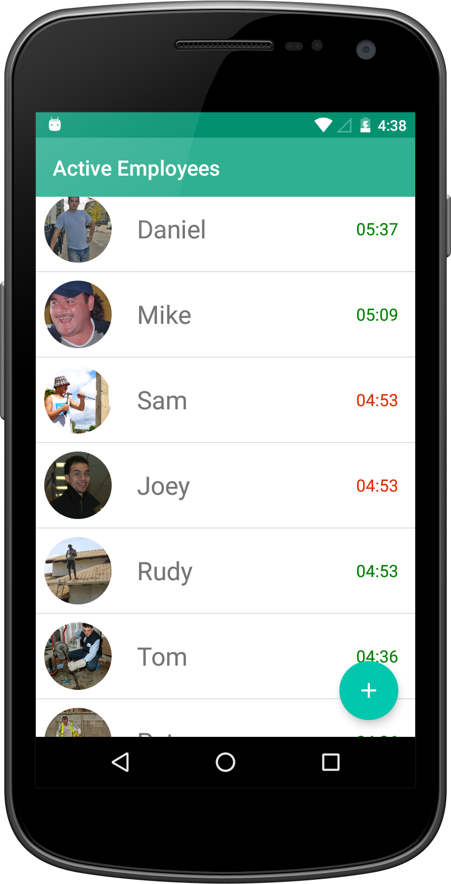
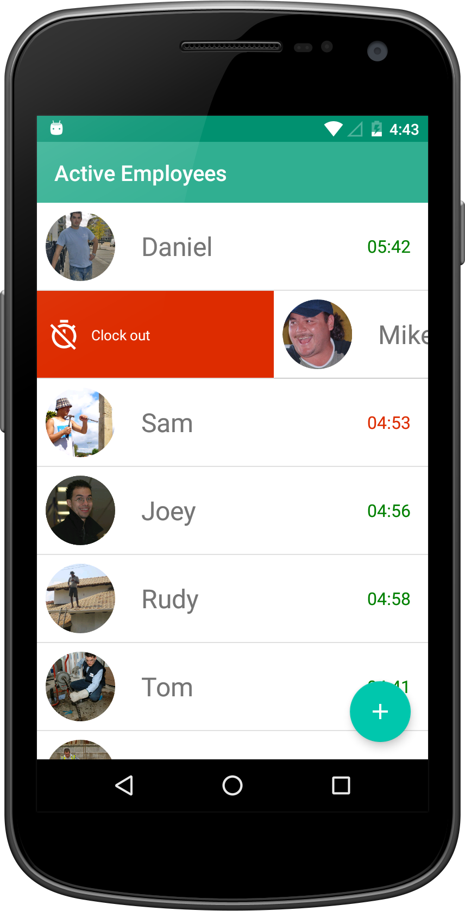
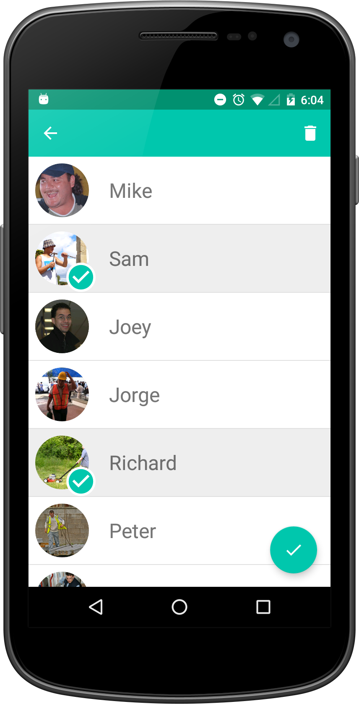

# Simple Time Clock

## Overview
SimpleTimeClock is an app that is ideal for employers who just need a straight forward info about the hours worked and the earnings employees make.
Constructions workers, temporary handyman jobs, on-call employees are among some of most suitable type of work that SimpleTimeClock will work best.
Just know how much employees need to be paid in a quick and simple way.
Adding a new employees just requires a name and wage. Optionally, a picture can be added too.

## Features
- Swipe-to-clockout action on active list of employees (first screen)
- Multi-selection on list of all employees (second screen)
- Optionally take a photo or add a picture from gallery

## Instructions on how to use the app
There are a total of 3 screens:

The first screen will display active employees (employees who are currently working). The time starts to run for employees on this list.
To remove an employee from this list, simply swipe right or left, then the time will stop running for that employee.

The second screen will display the list of all the employees (either working or not). On this screen you can:
- Add a new employee
- Delete an employee
- Add an existing employee to the active list

To see the delete and adding to active list option, you need to perform a long tap on the list, then these two options will appear.
The bin icon on the toolbar is the delete option; the round button on the right-bottom corner of the screen is for adding the selected
employees to the active list.

The third screen displays the details of an employee. You can open it from first or second screen by taping on a particular employee.
The details of the employee is divided in two parts: unpaid and totals.
Unpaid, as the name implies, shows unpaid time and earnings. This is the amount the employer needs to pay. A pay option will appear
when the employee is not working.
Totals is just some numbers for reference to see the total of hours and earnings a particular employee made.

## Screenshots
First screen

 

Second screen

 

Third screen

